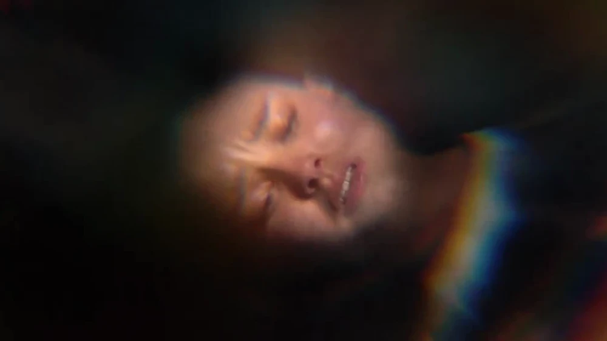
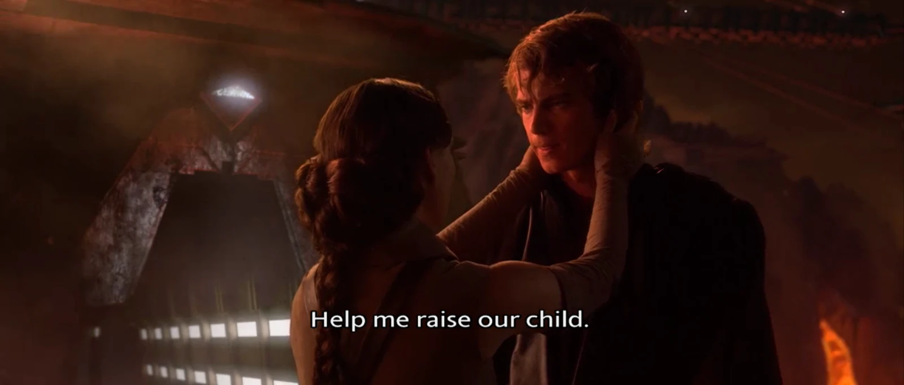
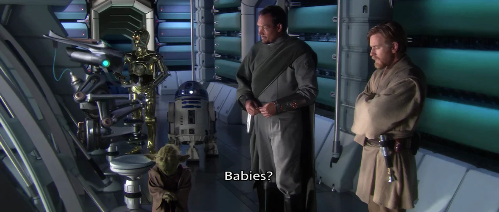
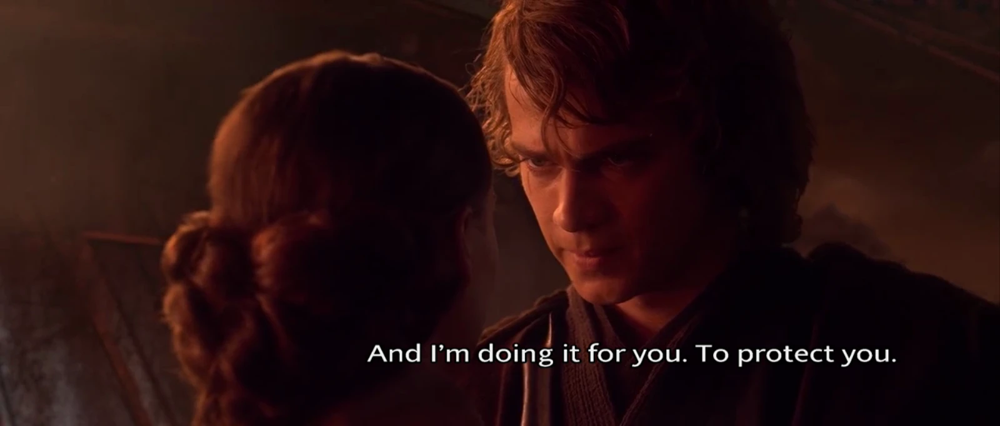
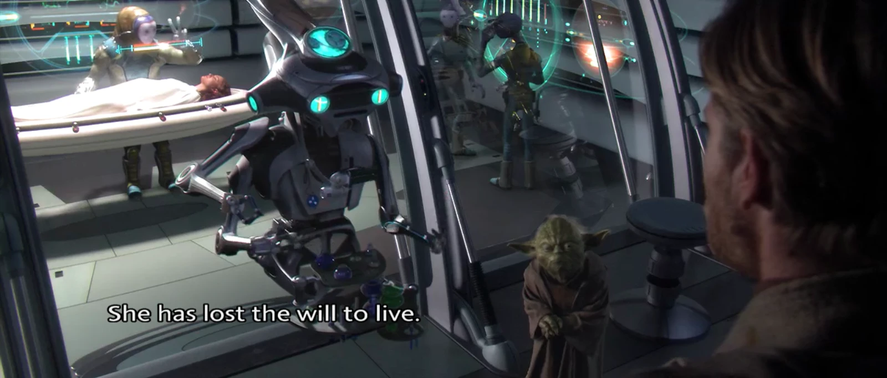
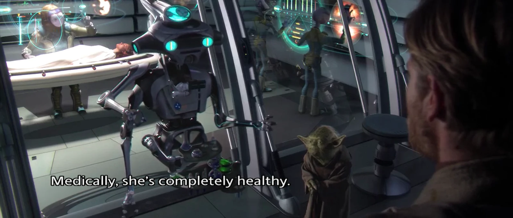
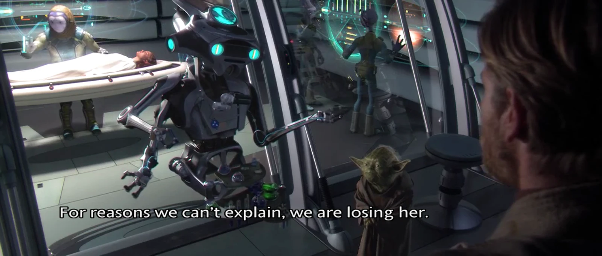
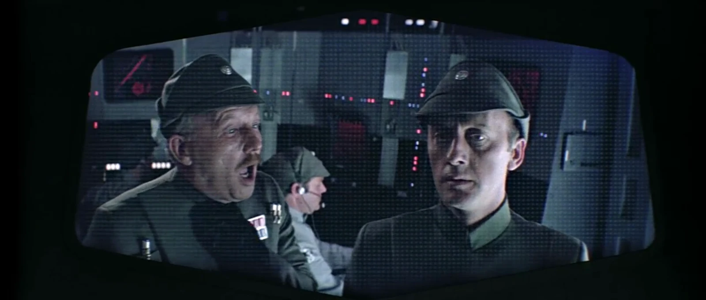

Why didn’t they just go to a goddamned obstetrician-gynecologist?

Exported from https://www.vice.com/en/article/53d4db/womens-healthcare-star-wars which was posted on 03 January 2017
by [Sarah Jeong](https://sarahjeong.net/)

<figure>
  
  <figcaption>Anakin's Force-vision of Padme's death</figcaption>
</figure>

The central, overarching conflict of the first six Star Wars movies is that a democratic republic devolves into an
authoritarian dictatorship. A key part of that political coup is Anakin Skywalker turning to the dark side and becoming
Darth Vader. The way the story is told implies that the fall of the Republic and fall of Anakin Skywalker are
linked—young Anakin is prophesied as the one to "bring balance to the Force." Indeed, Darth Vader's redemption and death
coincide with the fall of the Empire and the rise of the New Republic.

Anakin's turn to the dark side begins in _Episode II_ with the death of his mother, but it's really the events of
_Episode III_ that are instrumental in changing him. And if you think about it, the trigger for his metamorphosis is
extremely weird. Anakin Skywalker allies himself with Palpatine in hopes that he can use the dark side of the Force to
save Padme Amidala from death in childbirth.

Shortly after Padme announces to him that she's pregnant, Anakin has a dream that she dies while giving birth. The dream
feels similar the same one he had about his mother before she died. "It's just a dream, honey," Padme tells him the next
morning. "Yeah, okay," he replies, but the man never regains his chill.

He seriously spends two hours of the movie freaking out about his wife's uterus, and hypes himself up so much that he
gets to the point of slaughtering tiny tots in a Jedi temple. All because he can't think of another way to save Padme
from reproductive health complications.

Why didn't they just go to a goddamned obstetrician-gynecologist?

## Padme Never Goes to a OB/GYN

Prenatal visits never happen in _Episode III_, not even offscreen. Despite Anakin's spiraling paranoia about Padme's
health, doctors or hospitals are bizarrely never mentioned. And the evidence says that Padme never got an ultrasound.

When she confronts Anakin towards the end of the movie—shortly before giving birth—she refers to "our child," rather
than "our children." It doesn't make sense for her to be hiding the ball here, she's making one last emotional appeal to
the father of her children, to try to bring him back to the light side. Rather, Padme simply doesn't know that she's
about to give birth to twins.

Later, when she actually gives birth, everyone is taken aback by the revelation that she's having babies in the plural.

All of this points to one thing: Padme's never had an ultrasound. In fact, Padme's never had a prenatal check-up.

## OB/GYNs Probably Don't Even Exist in the Star Wars Universe

If there were any women's healthcare available, there is no reason why Padme wouldn't take advantage of it. For one
thing, her husband is flipping the fuck out over her possibly dying in childbirth. Why didn't she visit a doctor in an
attempt to soothe his fevered mind?

Even if access to reproductive health services is limited in this galaxy—as in ours—Padme is probably the woman best
situated to get it. She's a sitting Senator residing in Coruscant, the capital of the galaxy. She's clearly a woman of
means, given that she has three elaborate costume changes for every hour of the day. Padme is hanging out in a posh
penthouse in the most populous city in the galaxy: if there's medical assistance out there, she can get it.

Furthermore, there is no bar to Padme and Anakin visiting the OB/GYN together. Although their marriage is a secret,
Padme doesn't hide the fact that she's pregnant. She still attends Senate sessions, and when Obi-Wan visits her, her
baby bump is evident and he even comments on it. Anakin has plenty of innocuous reasons to hang around Padme and even
accompany her to a doctor's office. She's a Senator, and he's a super magic law enforcement agent frequently assigned to
protect politicians (including her, in _Episode II_).

And if the couple were still super paranoid about visiting the doctor together, she could just go by herself. It's not
like "ANAKIN SKYWALKER IS THE SECRET FATHER OF MY BABY" is written on her cervix.

## Lack of Medical Options Makes Anakin Just Lose His Shit

If you think your wife is going to die due to birth complications, your first thought isn't going to be, "Yes, I should
help install a dictatorship and then murder small children, to protect her." But that is the conclusion that Anakin gets
to. And fear for Padme's life is the direct cause of that.

Maybe Anakin is just extremely
stupid ([an explanation we can't ignore](https://twitter.com/sarahjeong/status/813650126266716161)), but given that
we've established that Padme never got an ultrasound, it seems more likely that there were no medical options that they
could turn to before his thought processes went straight to "Betray The Jedi Order And Everything I Believe In."

In a galaxy of [bacta tanks](http://starwars.wikia.com/wiki/Bacta_tank) that can heal grievous wounds, and highly
advanced cybernetic prosthetics to replace limbs, reproductive health is stuck in the middle ages.

At the end of _Episode III_, Anakin gets three limbs chopped off and then falls into hot lava. He lives.

His wife has babies, under medical supervision. She dies.

## Padme's "Will to Live"

[Since tweeting about the OB/GYN plot hole](https://twitter.com/sarahjeong/status/813684330723586048), I've received
countless messages from men who are furious with me about letting "feminism ruin" _Revenge of the Sith_, which might be
the first time that fans have ever crawled out of the woodwork to defend _Star Wars_ prequels. A primary contention is
that Padme didn't die from medical causes, but merely "lost the will to live."

This is logically irrelevant.

My point isn't that Padme died of postpartum bleeding or eclampsia , my point is that Anakin's transformation into Darth
Vader is triggered by his fear of childbirth complications. Padme dies
after

his turn to the dark side: her actual cause of death doesn't matter.

But that aside, let's talk about how incredibly stupid "She has lost the will to live" actually is.

Consider the provenance of the diagnosis. It's a medical droid that first says that they don't know the actual medical
cause of her rapid deterioration.

The droid then goes onto pronounce that she has "lost the will to live," despite leading with an admission that they
don't know what's wrong. How is that consistent? And why would a robot be programmed to detect "will to live"? In short,
this droid is completely full of shit.

That said, depression after giving birth, and death caused by emotional shock, are both real things. But they're medical
things, with diagnosable symptoms and actual medical remedies. The same thing goes for a death caused by Anakin
Force-choking Padme when she goes to confront him. A Force-choke is still a choke, and a choke is a physical cause of
injury. If any of these things actually caused Padme's death, then this droid is just an incompetent fuck who doesn't
know what it's doing.

## Death from "Broken Heart" Is Real

[There really is an actual medical phenomenon in which people die of a broken heart](https://www.washingtonpost.com/news/to-your-health/wp/2016/12/29/theres-a-medical-term-for-dying-of-broken-heart-is-this-what-happened-to-carrie-fishers-mother-debbie-reynolds/).
It's called Takotsubo cardiomyopathy, or "broken-heart syndrome." Grief from a loved one's death can trigger one's own
death.

A study published by the New England Journal of Medicine in 2005 said that stress hormones can "stun" the heart into
spasming. Most people recover, but some of them do die.

But the point is that broken-heart syndrome manifests as literal heart failure: the left ventricle of the heart spasms
the way it does in a conventional heart attack caused by blocked arteries. But cardiac failure isn't mentioned by the
medical droid.

## Being Real Sad After Giving Birth Is a Thing

And neither is [postpartum depression](https://en.wikipedia.org/wiki/Postpartum_depression) for that matter. Severe
depression after having a baby is actually very common, and there are real treatments available. But in general, you
don't really just up and die from postpartum depression. However, you'd think that if Padme were dying from being very
sad, someone would at least _mention_ postpartum depression? You know, in passing. Maybe even eliminating it as a
possible diagnosis.

But no, in _Revenge of the Sith_, everything related to birth is just a big question mark hanging over the characters.
Who even _knoooooows_ how uteruses work? Sometimes they just kill people, randomly, because you get sad.

## Palpatine Did Not Kill Padme

For days I've had hordes of men telling me that Palpatine stole Padme's will to live. This makes absolutely no sense and
it's not just because that's the stupidest thing I've ever heard. Let's approach this logically, while looking at the
canon.

First off, there's no mention or hint of this in the actual film.

Secondly, there are no instances in any of the films in which a Jedi or Sith is able to harm someone else from a
distance that requires hyperspace travel. Jedi and other Force-sensitive people are able to sense the deaths of others
from a great distance. See, for example, Obi-Wan sensing the destruction of Alderaan while still in hyperspace (_A New
Hope_), Yoda feeling the deaths of Jedi from all over the galaxy (_Revenge of the Sith_), or Leia sensing Han Solo's
death (_The Force Awakens_). But being able to actually strike at people, or even physically locate them is something
else entirely.

When Vader Force-chokes people, it's usually people who are in the same room as him. The one exception is in the _Empire
Strikes Back_, when he kills Admiral Ozzel while teleconferencing with him, and then promotes Captain Piett on the spot.
During this incident, Admiral Ozzel's ship is orbiting the planet Hoth, having just arrived in the system to attack the
Rebel base. Vader is aboard Star Dreadnought _Executor_, and is also present for the battle of Hoth. Therefore, at
_most_, a Force-choke is possible if the choker and the chokee are present in the same star system.

Darth Vader Force-chokes Admiral Ozzel (left) while simultaneously promoting Captain Piett (right) to Admiral

<figure>
  
  <figcaption>Darth Vader force-chokes admiral Ozzel (left) while simultaneously promoting captain Piett (right) to admiral</figcaption>
</figure>

And besides, if Palpatine could remotely kill or even locate someone across hyperspace distances via the Force, there
would probably be a few people ahead of Padme on the list. For example, Obi-Wan Kenobi, who is known to be accompanying
Padme.

## If Padme Died From Being Sad, It's Directly Caused By Anakin's Fear of Childbirth

But back to the point: her actual cause of death is irrelevant. Even if we do accept the inane premise that she lost the
will to live and died of being sad about Anakin, she's only sad because Anakin has completely lost his shit after
psyching himself out over her imminent death in childbirth. If Anakin hadn't been frightened out of his mind about the
deadly capacities of Padme's fallopian tubes, he wouldn't have turned to the Dark Side.

This is what counts as dramatic irony for George Lucas, and while plenty can be said on his "writing," that is neither
here nor there.

Okay, fine, I can't resist commenting on his writing. The giant OB/GYN plot hole isn't really about the _Star Wars_
universe having inadequate reproductive health care, it's about Lucas lazily relying on a blanket of ignorance
surrounding the entire phenomenon of childbirth. Childbirth is a black box that can explain anything that is difficult
to explain, like how Anakin can turn on everyone he loves and all the principles he holds dear, or how Padme can just up
and die without anything being visibly wrong.

Reproductive health and childbirth is a crutch, and Lucas gets away with it because his audience accepts that these
things are mysterious and cannot be intervened with the way that that the loss of limbs can be remedied with robot
prosthetics, or the way Luke can be rescued from near-death on Hoth by being submerged in a bacta tank. Having babies is
worse than being mauled by a wampa ice creature or being chopped up by lightsabers and falling into a river of lava.
Lucas can write a world like that, and worse, the audience will accept it.

But uteruses aren't made of malignant magic. Women's bodies are real physical things that can be studied and understood
and when necessary, cured. The public at large should be better educated about reproductive health in general. Like
ankle sprains, tooth decay, or heart attacks, reproductive health should be a banal medical thing that a lot of people
know something about. The fact that there's so much ignorance around it is a disgrace, a disgrace just as massive and
overwhelming as the very existence of the Star Wars prequels.

I guess what I'm saying is, maybe if the Galactic Senate hadn't defunded Planned Parenthood, the Republic wouldn't have
succumbed to an evil fascist dictatorship.
