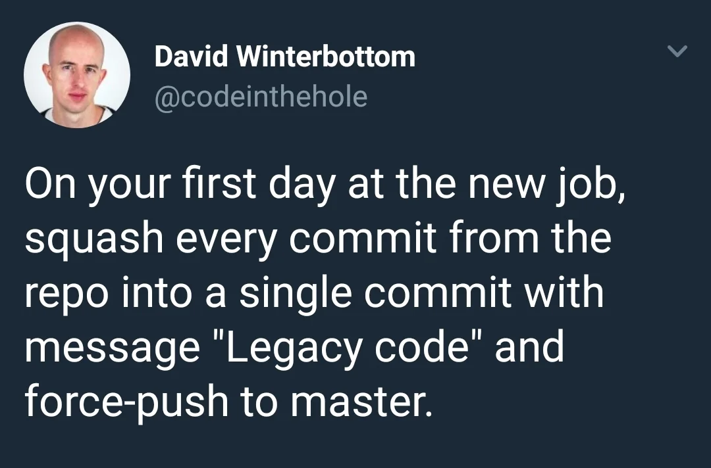

Exported
from https://medium.com/feature-creep/the-software-engineer-s-guide-to-asserting-office-dominance-ddea7b598df7#.rezim5fbs
which was posted on 22 Jan 2016 by [Daniel Wu](https://medium.com/@dangwu)

As a software engineer, changing jobs is a way of life. Every day, beautiful recruiters from top tech companies reach
out to you on LinkedIn with new opportunities, and each new job equals higher pay and an opportunity to reinvent
yourself for the better — as long as you know _how_ to. Here is a handy first-week guide to becoming the alpha of your
new workplace.

## Monday

On your first day of work, your focus should be entirely on Physical Establishment of Dominance in the Office. Humans
are hard-wired to follow the biggest and strongest. Once you have proven yourself with the PEDO principle, you will
command the respect and admiration of your team, and every other aspect of becoming the alpha naturally falls into
place.

Wake up early on Monday, hit the weights and dehydrate yourself for enhanced vascularity. Take a shower afterwards, but
put your tight-fitting, sweaty Under Armour gym clothes back on. You’ll arrive at work looking swole, focused, and ready
to get shit done.

After arriving at work, your number one priority is picking your desk. If you can get a standing desk, get one. Being at
higher ground is a position of power. This advantage is especially important in open-office environments. People need to
look up to you — even if only literally. Always pick a corner desk when available, and position it with your back to the
corner so you are overlooking your coworkers. Angle your monitors so that one is only visible by you. Needless to say,
this is your dedicated Facebook monitor. For your other monitor, keep code and a terminal on full display at all times.

Optimize lunch time by mixing protein shakes and doing body weight exercises.

After lunch, bring a ten pound tub of whey protein powder to your desk and slam it down. Ten pounds is the largest size
of the powder that is currently sold. If larger sizes are sold in the future, you should obviously switch to that. And
don’t wait until you finish your current tub either. Immediately purchase the larger size and display it in a prominent
position on your desk.

The brand of the protein powder must be Optimum Nutrition, as it is the gold standard of whey. You are the gold standard
of software engineering. You’ll need at least two Blender bottles as well, with three to four being the most optimal
number. Leave them around the office as a form of territorial marking.

Spend the rest of the day meeting your teammates and noting their weaknesses. At night, prepare ten hard-boiled eggs for
Tuesday.

## Tuesday

After Monday’s display of physicality, you need to spend Tuesday getting your development environment set up. Checkout
your team’s code from the git repo and start ramping up. If your new team doesn’t use git, announce your resignation
immediately and walk out.

Eat your hard-boiled eggs sporadically throughout the day, but save one. Do not take any breaks except to mix protein
shakes. Remember that you should be consuming one gram of protein per pound of body weight, or per line of code
written — whichever is greater.

Spend the rest of the day familiarizing yourself with the team’s codebase. Every five to ten minutes, let out a deep
sigh and write something down on a notepad. Maintain a demeanor of mild disgust on your face that gets increasingly more
annoyed as you browse through more and more of the code. Mumble words like “refactor” and “rewrite” under your breath.
Start drawing random complex architectural diagrams on your whiteboard. By 3 PM you should be visibly angry. Eat some
chili peppers to force yourself to sweat. At 4 PM, allow your rage to boil over and throw your last egg at the wall in a
fit of rage. Slam your laptop closed and head home early.

## Wednesday

Wednesday is time to institute your technical sovereignty. Be the first one at your daily stand-up, and run it like the
Scrum master you know you are. If someone talks for more than ten seconds, immediately interrupt them and tell them to
take it offline. Bring a notepad and take notes with a black pen. Keep a second red pen in your pocket.

When it’s your turn to speak, go on a long rant about all the horrible design patterns you’ve discovered in the code on
Tuesday. Announce that you have already started designing the architecture of the inevitable re-write. Name-drop as many
of the latest software frameworks and technologies as possible throughout your rant. Use words like big data, cloud, and
scalability. Mention test-driven development at least three to four times.

As you are speaking, lock eye-contact with the person to your left, and do not break until they look away. At this
point, lock eye-contact with the person to their left, and do the same. By the time you are finished speaking, you will
have gone full circle and sent a clear alpha signal to each of them. Perform this ritual at every stand-up.

If someone tells _you_ to take it offline while you are speaking, brush it off. Inform them that what are you saying is
the most important thing that has ever been spoken at this company. Then, pull the red pen out of your pocket and
scribble their name down.

## Thursday

By Thursday, you have demonstrated that you are the strongest, smartest, and most passionate engineer on your team. When
you get to your desk, rip your standard-issue keyboard out and slide it off your desk. Plug in your own mechanical
keyboard with Cherry MX Green or Blue switches. Your typing will now be a constant audible reminder to your teammates
that you aren’t fucking around.

Log into your team’s bug-tracking software and look around for some low-hanging fruit to fix. Spend the rest of the day
working and fixing them, but don’t send any code reviews out.

As you are working, make sure to look extra pissed off at all times, like you can’t believe how your teammates managed
to write such crappy code. Type more and more furiously as the day progresses. Do not eat lunch. Do not take breaks.
Only leave your desk when you are the last man in the office.

At around 10 PM, remote in from home and send your first CR out to your team. In an hour, send another CR out. You
should have fixed enough bugs during the day to do this for the next four to five hours. You are one hard-working,
dedicated, bad-ass motherfucker.

## Friday

It’s the last day of your first week, and if you followed this guide perfectly you are now undoubtedly the alpha of your
new team. Send a working-from-home e-mail out and take the day off. You deserve it.
